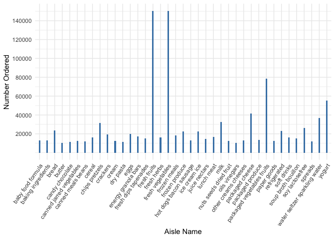
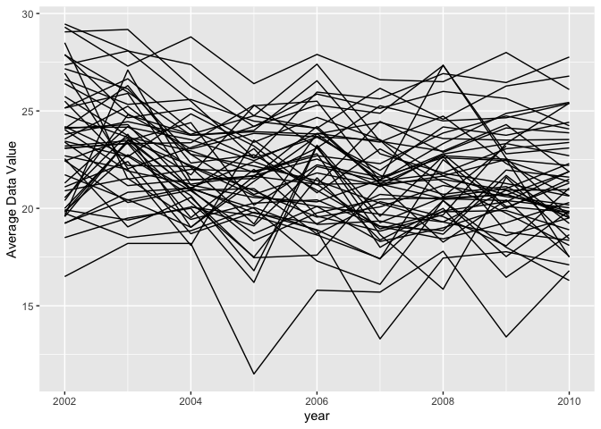
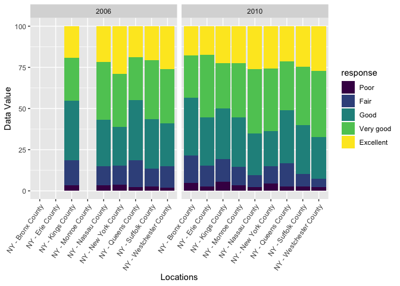

Homework 3
================

## Problem 1

``` r
library(tidyverse)
library(ggridges)
devtools::install_github("p8105/p8105.datasets")
library(p8105.datasets)
data("instacart")
```

The data ‘instacart’ contains 1384617 observations and 15 variables.
There are four character vairables: ‘eval\_set’, ‘product\_name’,
‘aisle’, and ‘department’; and the other variables are all integer,
such as ‘order\_id’, ‘order\_number’, ‘order\_dow’. Here listed few
observations as
example:

| order\_id | product\_id | add\_to\_cart\_order | reordered | user\_id | eval\_set | order\_number | order\_dow | order\_hour\_of\_day | days\_since\_prior\_order | product\_name                                 | aisle\_id | department\_id | aisle                | department |
| --------: | ----------: | -------------------: | --------: | -------: | :-------- | ------------: | ---------: | -------------------: | ------------------------: | :-------------------------------------------- | --------: | -------------: | :------------------- | :--------- |
|         1 |       49302 |                    1 |         1 |   112108 | train     |             4 |          4 |                   10 |                         9 | Bulgarian Yogurt                              |       120 |             16 | yogurt               | dairy eggs |
|         1 |       11109 |                    2 |         1 |   112108 | train     |             4 |          4 |                   10 |                         9 | Organic 4% Milk Fat Whole Milk Cottage Cheese |       108 |             16 | other creams cheeses | dairy eggs |
|         1 |       10246 |                    3 |         0 |   112108 | train     |             4 |          4 |                   10 |                         9 | Organic Celery Hearts                         |        83 |              4 | fresh vegetables     | produce    |

``` r
aisle = 
  instacart %>% 
  select(aisle, aisle_id) %>% 
  group_by(aisle_id, aisle) %>% 
  count() %>% 
  arrange(desc(n))
head(aisle, n = 1) %>% knitr::kable(align = 'l')
```

| aisle\_id | aisle            | n      |
| :-------- | :--------------- | :----- |
| 83        | fresh vegetables | 150609 |

There are 134 aisles, and most items are ordered from aisle number 83
“fresh vegetables”.

``` r
aisle %>% filter(n > 10000) %>% arrange(desc(n)) %>% 
  ggplot(aes(x = aisle, y = n)) +
  geom_bar(stat = "identity", fill = "steelblue", width = 0.2) +
  labs(x = "Aisle Name", y = "Number Ordered") +
  scale_y_continuous(
    breaks  = c(20000, 40000,  60000,  80000,  100000, 120000, 140000, 160000)) +
  theme_minimal() +
  theme(axis.text.x = element_text(angle = 55, hjust = 1))
```

<!-- -->

Among the aisle “baking ingredients”, “dog food care”, and “packaged
vegetables fruits”, the three most popular and their times of being
ordered are shown in table below:

``` r
popular_item =
  instacart %>% filter(aisle %in% c("baking ingredients", "dog food care", "packaged vegetables fruits")) %>% 
  group_by(aisle, product_name) %>% 
  summarise(order_times = n()) %>% 
  arrange(aisle, desc(order_times)) %>% 
  slice(1:3)

popular_item %>% knitr::kable(align = 'l')
```

| aisle                      | product\_name                                 | order\_times |
| :------------------------- | :-------------------------------------------- | :----------- |
| baking ingredients         | Light Brown Sugar                             | 499          |
| baking ingredients         | Pure Baking Soda                              | 387          |
| baking ingredients         | Cane Sugar                                    | 336          |
| dog food care              | Snack Sticks Chicken & Rice Recipe Dog Treats | 30           |
| dog food care              | Organix Chicken & Brown Rice Recipe           | 28           |
| dog food care              | Small Dog Biscuits                            | 26           |
| packaged vegetables fruits | Organic Baby Spinach                          | 9784         |
| packaged vegetables fruits | Organic Raspberries                           | 5546         |
| packaged vegetables fruits | Organic Blueberries                           | 4966         |

The mean hour of the day at which “Pink Lady Apples” and “Coffee Ice
Cream” are ordered on each day of the week are shown below:

``` r
hour = 
  instacart %>% filter(product_name %in% c("Pink Lady Apples", "Coffee Ice Cream")) %>% 
  select(product_name, order_dow, order_hour_of_day) %>% 
  group_by(product_name, order_dow) %>% 
  summarise(mean_hour = mean(order_hour_of_day)) %>% 
  pivot_wider(
    names_from = "order_dow",
    values_from = "mean_hour"
  )

hour %>% knitr::kable(align = 'c', digits = 1)
```

|  product\_name   |  0   |  1   |  2   |  3   |  4   |  5   |  6   |
| :--------------: | :--: | :--: | :--: | :--: | :--: | :--: | :--: |
| Coffee Ice Cream | 13.8 | 14.3 | 15.4 | 15.3 | 15.2 | 12.3 | 13.8 |
| Pink Lady Apples | 13.4 | 11.4 | 11.7 | 14.2 | 11.6 | 12.8 | 11.9 |

## Problem 2

Load the data from package:

``` r
data(brfss_smart2010)
brfss =
  brfss_smart2010 %>% janitor::clean_names() %>% 
  filter(
    topic == "Overall Health",
    response %in% c("Excellent", "Very good", "Good", "Fair", "Poor")
    ) %>% 
  mutate(
    response = as.factor(response), 
    response = fct_relevel(response, c("Poor", "Fair", "Good", "Very good", "Excellent"))) %>% 
  arrange(response)
```

Find the states that were observed at 7 or more locations:

``` r
#In 2002:
brfss %>% filter(year == "2002") %>% 
  group_by(locationabbr) %>% 
  summarise(number_observed = n_distinct(locationdesc))  %>% 
  filter(number_observed >= 7) %>% 
  knitr::kable()
```

| locationabbr | number\_observed |
| :----------- | ---------------: |
| CT           |                7 |
| FL           |                7 |
| MA           |                8 |
| NC           |                7 |
| NJ           |                8 |
| PA           |               10 |

In 2002, CT, FL, MA, NC, NJ and PA were observed at 7 or more locations;

``` r
#In 2010:
brfss %>% filter(year == "2010") %>% 
  group_by(locationabbr) %>% 
  summarise(number_observed = n_distinct(locationdesc))  %>% 
  filter(number_observed >= 7) %>% 
  knitr::kable()
```

| locationabbr | number\_observed |
| :----------- | ---------------: |
| CA           |               12 |
| CO           |                7 |
| FL           |               41 |
| MA           |                9 |
| MD           |               12 |
| NC           |               12 |
| NE           |               10 |
| NJ           |               19 |
| NY           |                9 |
| OH           |                8 |
| PA           |                7 |
| SC           |                7 |
| TX           |               16 |
| WA           |               10 |

In 2010, CA, CO, FL, MA, MD, NC, NE, NJ, NY and OH were observed at 7 or
more
locations.

``` r
#Construct a dataset that is limited to Excellent responses, and contains, year, state, and a variable that averages the data_value across locations within a state
average = 
  brfss %>% filter(response == "Excellent") %>% 
  group_by(year, locationabbr) %>% 
  summarise(avg_value = mean(data_value, na.rm = TRUE)) %>% 
  rename(state = locationabbr) 
#“Spaghetti” plot of this average value over time within a state
average %>%   
  ggplot(aes(x = year, y = avg_value)) +
  geom_line(aes(group = state)) +
  labs(y = "Average Data Value")
```

<!-- -->

Two-panel plot showing distribution of data\_value for responses (“Poor”
to “Excellent”) among locations in NY State for the years 2006 and 2010,
:

``` r
#Filter NY state and year
ny_value = 
  brfss %>% filter(year %in% c("2006", "2010"), locationabbr == "NY") %>% 
  select(year, response, data_value)

#Make boxplot
ny_value %>% 
  ggplot(aes(x = response, y = data_value)) +
  geom_boxplot() +
  facet_grid(~year) +
  labs(y = "Data Value", x = "Response") 
```

<!-- -->
Comparing the plots for 2006 and 2010, we can see that the median data
value in each response group did not change much except the small
elevation in the ‘very good’ group.

## Problem 3
